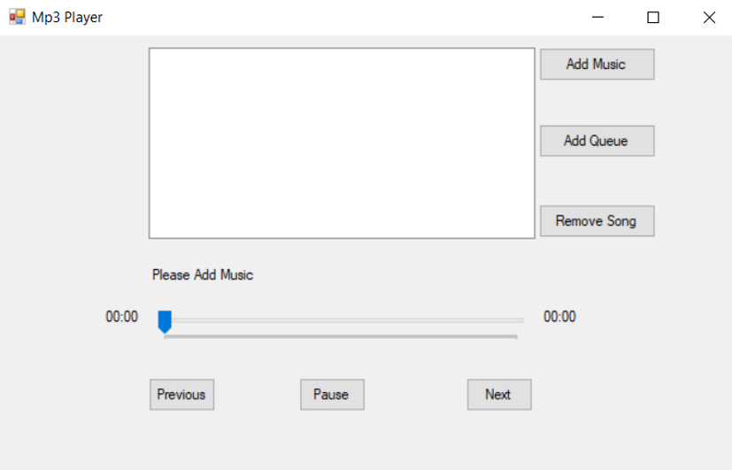

# C# MP3 Player with Linked List Logic

## Overview
This MP3 Player, developed in C#, allows users to manage their music playlist efficiently. Key features include adding music, creating queues, removing songs, and controlling playback (play/pause, previous/next). The project is designed with a focus on implementing logic using linked lists for playlist management.

## Features
- **Add Music:** Build your playlist by adding your favorite songs.
- **Add Queue:** Create custom queues for different moods or occasions.
- **Remove Song:** Easily manage your playlist by removing unwanted songs.
- **Playback Controls:** Control your music with play/pause, previous, and next functionalities.
- **Linked List Logic:** The project leverages linked lists to handle the underlying playlist structure.

## Getting Started
1. **Clone the Repository:**
   ```bash
   git clone https://github.com/dinithmaleesha/mp3-player-linkedlist.git

## UI

